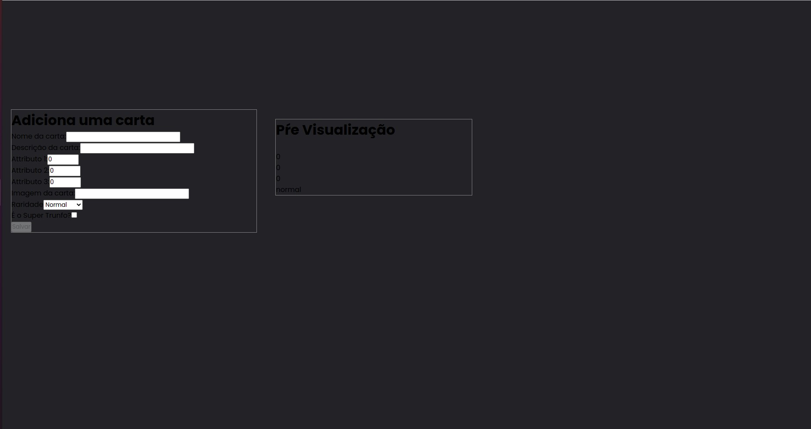

## Project 2 - Front-end module - Tryunfo

---

# Skills and technologies used in this project:

* _React 
* _CSS 3 
* _JavaScript 

---

## What is the project about?

This project was realized with component and state concepts in React.
Project under development.

---

# Instructions for running the project:

1. Clone the repository
  * `git clone git@github.com:CrisSouzaMA/trybetryunfo.git`
  * Entre na pasta do repositório que você acabou de clonar:
    * `cd tryunfo`

2. Initialize the project
    * `npm start` (a new page should open in your browser with the project)

---

### To-do List:

- [ ] Refactor
- [ ] Responsiveness
- [ ] Make CSS

Bye 🖐️

